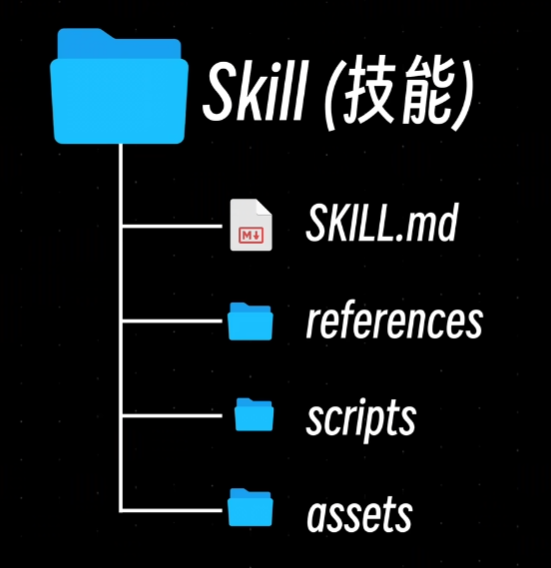

# Skill 相关内容

最近刚好在学习skill 相关内容，然后就整理了这个文档。


前置内容知识


Prompt(22-23年)  ---> 规则(Rules  23中旬) --->Skill( 25) ---> MCP( 24年底)  ---> Harness( 26) .....

(具体时间可能存在差异)

本次表达 --->长期约束---> 可复用能力--->  外部工具--->  运行控制


同一件事情，每次都需要重新教AI一遍吗？

对于重复出现问题，或者是类似重复的工作，通常可以以下做法

1. 将要求写入这一轮的 Prompt

```markdown
# 会议纪要
请阅读会议内容，再按照下面要求整理：
    1. 不要编负责人
    2. 没说日期就写“未知”
    3. 后单独列行动项
    4. 后单独列行动项
```

2. 将长期规矩写入到项目文件  (撰写AGENTS.md / CLAUDE.md)

```markdown
这个项目里，每次都要守:
	1. 不要编负责人
    2. 没说日期就写“未知”
    3. 后单独列行动项
    4. 后单独列行动项
```

3. 将常做的任务存成可调用流程 (将一个问题的解决方法拆成 x 步，一步一步执行)：	

​					0 ---> 1 .....---> x


对于 skill 可以简单的理解为： Skill = 给 AI 一个 "这类工作如何完成" 的说明书





## skill 安装

在安装之前，一般要注意一些内容(总不能看到一个skill 就进行安装)

1. 来源(安全性如何？)
2. 版本(不同版本可能存在差异)
3. 落点(新增 或者覆盖哪里？)
4. 行为(脚本会做什么？)

其中"落点"一般分两级：

- 全局级：装在用户目录下（如 `~/.claude/skills/`），所有项目都能用；
- 项目级：装在项目仓库里（如 `.claude/skills/`），只对这个项目生效，还能随 git 分享给协作者。

越通用的能力越放全局，越和项目绑定的越放项目里。


一般的skill 目录结构：

```markdown
xxx-skill/
|---references/（需要时再读的资料）
|---scripts/  （稳定执行的脚本和检查）
|---assets/ （反复使用的模板和素材）
|---SKILL.md （入口 + 触发说明 + 做事步骤）
.....
```

`4` 个文件或目录，只有 `SKILL.md` 文件是必须的，其它 `3` 个目录都是非必须的

`references/` ：参考文献的目录，里面是各种补充文档，**有需要的时候再加载**。

`scripts/` ：代码目录，里面是可执行的代码脚本

`assets/` ：其它材料目录，里面存放图标、模板、图片、字体等资源


## skill 是怎么被用到的：按需加载

上面把 skill 比作说明书，但 AI 的上下文窗口有限，不可能把所有说明书都背在身上。skill 的核心机制就是**按需加载（渐进式披露，Progressive Disclosure）**，大致分三层：

1. **启动时**：只读取每个 skill 的 `name` 和 `description`（相当于一行"简历"），挂在系统提示词里。单个 skill 只花几十个 token，装很多个也不心疼。
2. **触发时**：当用户的任务和某个 skill 的描述对上号，AI 才把这个 skill 的 `SKILL.md` 完整读进上下文，这时它才知道"这件事具体怎么做"。
3. **执行中**：`SKILL.md` 里指向的 `references/` 文档、`scripts/` 脚本，需要哪份再读哪份，用完就放手。

```
启动时：  [skill A 一行简介] [skill B 一行简介] [skill C 一行简介]   ← 只有几行字
              |
              |   用户说"帮我整理会议纪要"，和 skill B 的描述匹配上了
              ↓
触发时：  完整读入 skill B 的 SKILL.md                               ← 这才知道怎么做
              ↓
执行中：  要查术语了？再去读 references/glossary.md                   ← 用到才读
```

对比着理解更清楚：MCP 是把所有工具的"封面 + 目录"一次性塞进上下文，装多了既挤占窗口、又干扰模型选择；而 skill 平时只留一行简历，被想起时才把整本手册拿出来。

回头看上面的目录结构，就明白它为什么长这样了：

- `SKILL.md` 要保持精简：只要被触发就必然**全文加载**，写太长等于每次触发都交一笔"过路费"；
- 细节拆到 `references/`：不是每次任务都用得上，按需读取就好；
- `description` 是唯一的"门牌"：AI 全靠它判断"现在该不该用这个 skill"，写得含糊，skill 就会在该出场的时候沉睡。

## 三个目录里都放什么

`SKILL.md` 之外的那三个目录，各自分工不同，放错地方会直接影响加载效率。

### references/ —— 给 AI 读的知识

放"不是每次都要读，但用到时必须读准"的资料：

- 领域规范与约定：比如公司纪要格式、术语表、历史决定记录
- 细分场景的处理说明：SKILL.md 写主干流程，冷门分支单独成文（如"遇到扫描件怎么办"）
- 外部资料摘录：API 文档、格式定义

用法要点：

1. 在 SKILL.md 里写明"什么情况读哪份"，例如：整理英文会议时，先读 references/glossary.md
2. 一个主题一个文件，文件名自解释，别堆成一个大杂烩
3. 优先 Markdown 等纯文本格式，方便模型阅读

### scripts/ —— 让结果确定的程序

放"每次执行都该一模一样"的操作：

- 确定性步骤：格式转换、批量重命名、数据校验
- 脚手架生成：一条命令把模板工程拉起来
- 自检工具：交付前跑一遍校验，确认成果合格

为什么值得写脚本：让模型即兴发挥，十次可能有两次出错；脚本写好一次，之后每次都是同样的执行。而且脚本在 SKILL.md 里只占一行调用说明，跑完只把结果带回上下文——比让模型一步步生成省 token，也更稳。

写脚本时注意：报错信息要清晰（失败了 AI 才知道怎么纠正），尽量幂等（重复跑不会把事情搞坏）。

### assets/ —— 拿来就用的素材

放"不是给 AI 读、而是给 AI 用来产出成果"的文件：

- 模板：PPT 母版、周报模板、网页 boilerplate
- 品牌素材：logo、字体、配色
- 参考样例：一份"合格交付物长什么样"

和 references 的区别一句话：references 的内容要**读进上下文**（花 token），assets 的东西是**直接复制、修改去用**（不进上下文，不花 token）。能做成模板的，就别写成说明书让模型每次现场发挥。

### 一张表分清

| 目录 | 放什么 | 怎么被用 | 占不占上下文 |
| --- | --- | --- | --- |
| `references/` | 知识、规范、细分说明 | 按需**读取** | 读哪份，哪份占 |
| `scripts/` | 确定性流程的脚本 | 按需**执行**，只回传结果 | 只占一行调用说明 |
| `assets/` | 模板、素材、字体 | **复制/引用**去产出 | 基本不占 |

## skill 设计与封装

### 设计前，先回答 5 个问题

1. 用户怎么说，它才出现？（触发条件）
2. 开始前拿到什么，最后交什么？（输入与输出）
3. 中间按什么顺序做？（步骤）
4. 哪些资料、程序或工具会被用到？（references / scripts / assets）
5. 做不下去或可能越权时，怎么停、怎么报、怎么验？（边界与验证）

这 5 个问题的答案填进模板，基本就是一份可用的 SKILL.md。

### 一个最小的 SKILL.md 骨架

还是以前面"整理会议纪要"为例，把 5 个问题的答案落进去：

```markdown
---
name: meeting-notes
description: 把会议记录整理成纪要。当用户给出会议内容并要求"整理纪要、列行动项"时使用
---

# 会议纪要整理

## 输入与输出
- 输入：用户提供的会议记录（转写稿、聊天记录等）
- 输出：一份纪要，包含 概要 / 要点 / 行动项（负责人、期限）

## 步骤
1. 通读记录，标出时间、人员、结论
2. 没说日期的一律写"未知"，不要编造负责人
3. 行动项单独列一节，格式固定：事项 / 负责人 / 期限
4. 拿不准的术语或缩写，查阅 references/glossary.md

## 边界
- 信息不足以判断的内容，标"待确认"，不要脑补
- 涉及薪酬、人事评价等敏感内容时，先停下来向用户确认，再决定写不写
```

对照着看：`description` 回答问题 1（什么时候出场），"输入与输出" 回答问题 2，"步骤" 回答问题 3 和 4，"边界" 回答问题 5。步骤 4 提到的术语表，就该躺在 references/ 里；如果还想附带一份行动项表格模板，那可以放进 assets/。

### 几条设计原则

1. **一个 skill 只做一件事**。长大了宁可拆成几个小 skill，触发也更准。
2. **description 写"什么时候用"，而不只是"是什么"**。它是按需加载机制里唯一的触发依据。
3. **SKILL.md 保持精简，细节外移**。主干步骤写进 SKILL.md，知识放 `references/`，确定性流程放 `scripts/`，模板素材放 `assets/`。
4. **边界要写清楚**。做不下去时怎么停、怎么向用户报告、怎么验证结果，提前写死比事后补救便宜。

到这里，skill 的图景就完整了：它不是更聪明的模型，也不是更强的工具，而是把"这类工作怎么做"的经验固化成一页纸，在合适的时机被想起、被翻开。
